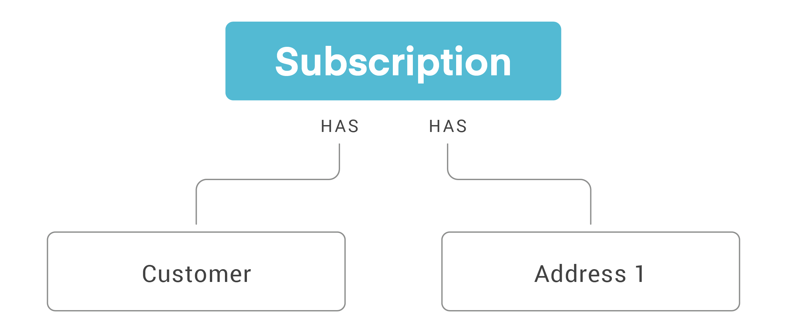
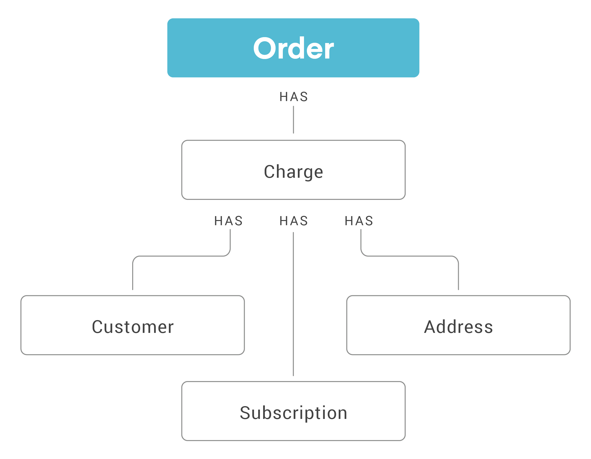

# Recharge - Honest Paws
{: .no_toc }

Data in recharge is abstracted in four key objects - Subscriptions, Customers, Addresses and Orders.



An order is created after a charge is successfully processed. The order contains all the same json data as the charge. In case of a prepaid order creation, the order will be queued for a particular date and submitted on that date to shopify.



---
```
This page is updated on Jan 11th, 2021.
```
